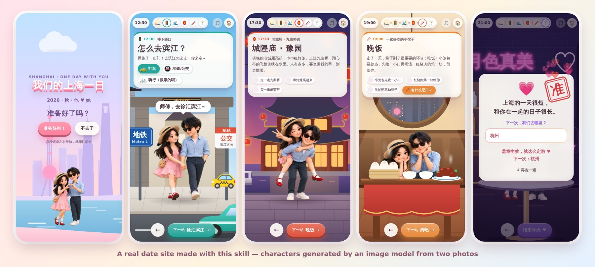
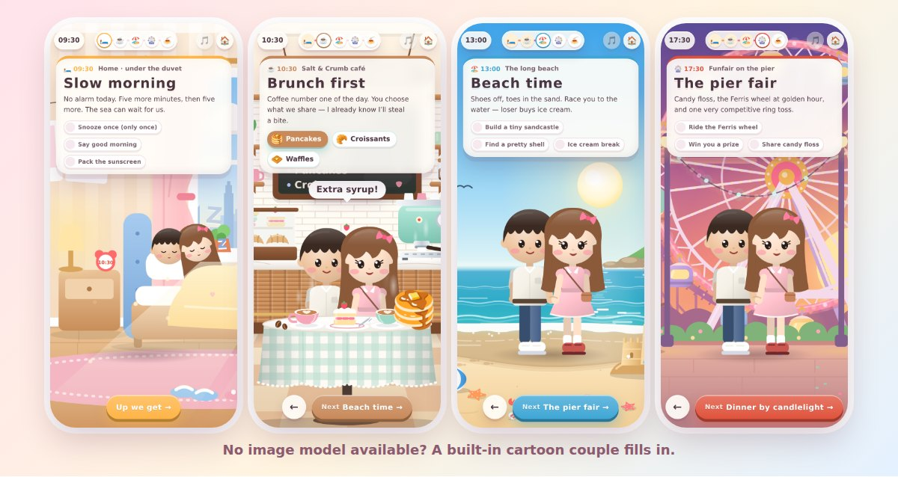
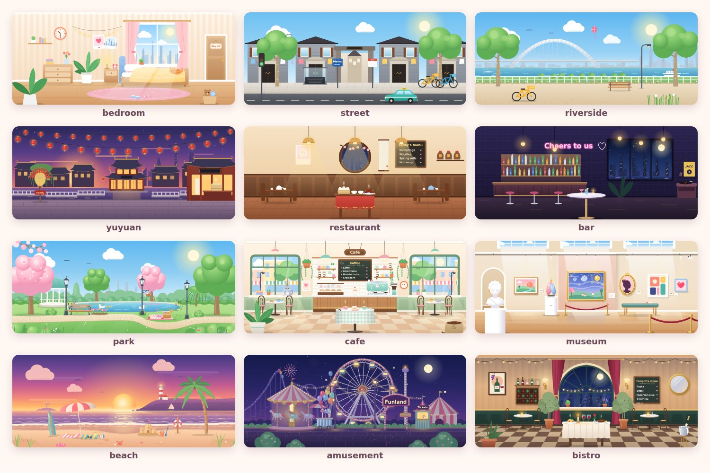

<div align="center">

# 💕 A Date Skill · 一日约会网站

**An AI-agent skill that turns your trip plan and two photos into a cute 3D-cartoon date website, starring the two of you.**<br>
**一个 AI 智能体技能：把你们的行程和两张照片，变成一个以你们俩为主角的 3D 卡通约会网站。**

[English](#english) · [中文](#中文)



</div>

---

## English

### What is this?

You give an AI agent (Claude Code, Codex, Cursor…) **your date plan** and **one photo of each of you**. The agent turns the photos into 3D-cartoon versions of you two with an image model, then builds and publishes a little website for your partner:

- **The cover** asks *"Ready?"*. The **"No"** button runs away and can never be tapped 🙃
- **Pick a date.** Your partner chooses the day on a calendar that only offers the dates you allow.
- **You two walk hand in hand** from stop to stop through hand-drawn scenes (home, city street, riverside, park, café, museum, beach, amusement park, restaurant, bistro, bar…). The clock and the progress bar advance as you go.
- **Every stop has a card**, with a sweet note and tiny missions to tick off. Tap the couple and they change pose and say something.
- **Questions along the way:** *how shall we get there?* (taxi / metro / bike), *anything you don't eat?*
- **The ending:** *"Where should we go next time?"*, then **Approve** ✅ or **I have suggestions** 💬. Their answers (date, choices, food, suggestions) arrive in your inbox or dashboard **once per run-through**.
- **It works everywhere:**
  - phone-first, background music, and the WeChat browser;
  - reachable from mainland China, because it uses no external fonts or CDNs;
  - all text in their language: Chinese, English and Japanese built in, and any other language through the config.

The screenshots above are from a real one: the author's own date in Shanghai, shared with permission.

**You don't need to know how to code.** The agent interviews you, drafts the itinerary if you don't have one, makes the characters, writes the site, checks it, and walks you through putting it online. That takes about 3 minutes with Netlify Drop, for free.

### How the characters are made

The couple is on every screen, so the skill **goes for an image model first**:

1. **The agent makes them itself.** It uses its own image tool if that tool can take your photos as a reference (or you'd rather describe yourselves than send photos). Or it uses your OpenAI or Google Gemini API key, set in your terminal rather than pasted into the chat: a bundled script calls the API for you.
2. **Otherwise, you make them** in ChatGPT, Gemini or 豆包 / 即梦. The agent hands you the exact prompt: you upload your photos, paste it, and send back the pictures. Free accounts work. If neither works and the agent's own tool takes text only, it draws you from a description.
3. **No image model at all, or you'd rather not use one?** A built-in cartoon couple, recoloured to match you, fills in. It's also the placeholder while your pictures are on their way.

If you already have a preference (your own key, or your favourite app), the agent uses that. Before your photos go anywhere, it tells you which service they'll go to, and you can say no.

The image model draws two sprite sheets on a green background: a walk cycle and six poses. The site keys out the green, slices the frames, lines them up, and walks you two through the day:


*The example is the author's own date site, with characters generated by gpt-image-2 from two photos (shared with permission; the images aren't for reuse, see [NOTICE.md](NOTICE.md)). See [`examples/shanghai-ai`](examples/shanghai-ai/).*

No photos? Describe yourselves (hair, glasses, outfits): image models draw from a description too.

When no image model is available, the built-in couple steps in:



It's cute, but it's the same two cartoon people for everyone (short hair and a shirt, long hair and a dress). That's why the image model comes first.

### What you need

| | |
|---|---|
| 🗺️ **A trip plan** | Paste your itinerary, or just say *"a day in Kyoto, we love food and temples"*, and the agent drafts one with you. |
| 📸 **Photos (recommended)** | One clear photo of each of you, or one of you both. No photos? A short description of each of you works too. |
| 🎨 **An image model (any one)** | The agent's own image tool, **or** an OpenAI / Google Gemini API key, **or** a free ChatGPT, Gemini or 豆包 / 即梦 account. None of these? The built-in cartoon couple fills in. |
| 🤖 **An AI agent that can run commands** | Claude Code, OpenAI Codex, Cursor, Gemini CLI, Windsurf, Cline… Node.js 18+ is used for the checks, the previews and the image script. |
| 🌐 **A free Netlify account** | To publish the site and receive the answers. Other hosts work too. |

### Quick start

**1. Install the skill.** Choose the option for your agent:

<details open>
<summary><b>Claude Code</b> (terminal, desktop app, or claude.ai/code)</summary>

```text
/plugin marketplace add mark24680617/A-Date-Skill
/plugin install one-day-date@a-date-skill
```

Or copy the folder by hand:

```bash
git clone https://github.com/mark24680617/A-Date-Skill
mkdir -p ~/.claude/skills && cp -r A-Date-Skill/skills/one-day-date ~/.claude/skills/
```
</details>

<details>
<summary><b>Claude.ai / Claude desktop app</b> (Skills)</summary>

1. Download [`one-day-date.zip`](https://github.com/mark24680617/A-Date-Skill/raw/main/dist/one-day-date.zip). It holds the `one-day-date` folder.
2. In **Settings → Capabilities**, turn on **Code execution and file creation**.
3. Open **Customize → Skills** and upload the zip.

In the web app, the site is built inside Claude's sandbox. You'll download the finished folder and drag it into Netlify Drop.
</details>

<details>
<summary><b>Codex, Cursor, Gemini CLI, Windsurf, Cline… (any agent)</b></summary>

```bash
git clone https://github.com/mark24680617/A-Date-Skill
cd A-Date-Skill
```

Open that folder with your agent and say *"Read skills/one-day-date/SKILL.md and follow it."* The repo's `AGENTS.md` points agents there automatically.
</details>

**2. Ask for your site.** For example:

> Use the one-day-date skill to make a date website for my girlfriend Mia. We're spending Saturday in Lisbon: pastéis for breakfast, the tram to Alfama, the LX Factory, sunset at Miradouro da Senhora do Monte, dinner in Bairro Alto. She reads English. Photos attached.

or simply:

> 帮我给女朋友做一个约会网站，下周六在杭州，你帮我安排行程。

**3. Answer the agent's few questions, look at the screenshots it shows you, and publish.** The agent tells you exactly where to click.

### Examples

| Example | Language | Characters |
|---|---|---|
| [`examples/shanghai-ai`](examples/shanghai-ai/) | 中文 | From an image model (gpt-image-2, two photos). The author's own day in Shanghai, shared with permission. |
| [`examples/seaside-en`](examples/seaside-en/config.js) | English | The built-in fallback couple. A seaside day. |

How to run them: [examples/README.md](examples/README.md).

### How the answers reach you

By default the site uses **Netlify Forms**: turn on *form detection* once, and each submission appears under **Forms → trip-reply** (with optional email notifications). Hosting somewhere else? Point `reply.to` at Formspree or FormSubmit, or turn answers off. See [deploy.md](skills/one-day-date/references/deploy.md).

**If your partner is in mainland China:**
- Netlify usually opens (sometimes slowly); Vercel and Cloudflare Pages are often blocked. The most reliable host is Tencent CloudBase static hosting, which needs a real-name-verified account.
- WeChat often blocks links to foreign domains: have them tap **··· → Open in browser**.
- For the characters, 豆包 / 即梦 are the easiest there. OpenAI and Gemini need access to the wider internet.

### Scenes



Twelve hand-drawn parallax scenes. Most have **day / sunset / night** moods, and signs you can relabel (café name, menu, bridge name…). For a famous landmark, the agent can generate a background image instead. See [scenes.md](skills/one-day-date/references/scenes.md).

### Privacy

- **Your photos** stay on your computer. They only go to the image service you agree to: the agent's image tool, the API your key belongs to, or the app you paste the prompt into. The agent names the service before sending them, and you can say no: it then works from a description, or hands you the prompts for your own app.
- **Your API key** is read from your computer's environment. It never goes into the website, and you don't need to paste it into the chat.
- **Image API use** is billed to your own account, a small amount per picture. The app route uses the app's free or paid allowance.
- **The published site is public** to anyone with the link, and hidden from search engines (`noindex`). Keep addresses and phone numbers out of it.
- **Nothing is collected** except the one answer your partner submits, and it goes only to where you point it.

### For developers

```
skills/one-day-date/
├── SKILL.md                 ← the agent's instructions
├── scripts/                 new-site · make-characters · validate · preview · serve  (Node 18+, no dependencies; preview uses Playwright if installed)
├── references/              interview, scenes, config, characters, backgrounds, deploy, troubleshooting; example/ (real image-model sprite sheets)
└── template/                the website: index.html, css/, js/ (main, art, couple, sprite, scenes/), assets/, tools/ (scenes, sprite-check, make-music)
examples/                    shanghai-ai (中文, image-model characters) · seaside-en (English, built-in couple)
tools/                       package.py (builds dist/one-day-date.zip) · screenshots.mjs (README images)
NOTICE.md                    the example couple's images are not under the MIT licence
```

```bash
node skills/one-day-date/scripts/serve.mjs skills/one-day-date/template       # run the example site
node skills/one-day-date/scripts/validate.mjs skills/one-day-date/template    # check it
open http://localhost:8080/tools/scenes.html?moods=1                          # scene gallery
```

- **Plain JS.** No build step and no framework: ES5-friendly JavaScript and SVG.
- **Characters.** `js/sprite.js` keys out the flat background of image-model sprite sheets (green, magenta or blue, detected from the border), slices the grid, and aligns the frames on the feet and upper body.
- **Image API.** `scripts/make-characters.mjs` calls OpenAI or Gemini with the user's key. Its prompt is the one in `references/characters.md`: keep the two word for word identical. Tests never call a real image API: point `OPENAI_BASE_URL` / `GEMINI_BASE_URL` at a local mock server and use fake keys.
- **Built-in couple.** `js/couple.js` draws it with a CSS walk cycle whose speed follows the ground.
- **Adding a scene.** See [`template/js/scenes/README.md`](skills/one-day-date/template/js/scenes/README.md). Contributions of new scenes are very welcome 💕
- **Before committing,** run `scripts/validate.mjs` (it must pass) and `scripts/preview.mjs` (no JS errors). After changing anything under `skills/one-day-date/`, rebuild the Claude.ai zip with `python3 tools/package.py`. [AGENTS.md](AGENTS.md) has the full list.

### License

[MIT](LICENSE). The bundled background music is an original piece generated by `skills/one-day-date/template/tools/make-music.py`, and is free to use.

**Except the example couple.** The sprite sheets in `examples/shanghai-ai/assets/characters/` and `skills/one-day-date/references/example/`, and the screenshots made from them, show the author and their partner. They are not covered by the MIT licence (all rights reserved), and are included only as an example of image-model output. Please don't reuse them for your own site: make your own. See [NOTICE.md](NOTICE.md).

---

## 中文

<div align="center"></div>

### 这是什么？

把**你们的约会行程**和**你们俩各一张照片**交给一个 AI 智能体（Claude Code、Codex、Cursor……）。它会用图像模型把照片变成 3D 卡通版的你们，再为你的另一半做好并发布一个小网站：

- **封面**问她「准备好了吗？」，**「不去了」**按钮会满屏乱跑，永远点不到 🙃
- **选日期**：日历上只有你允许的那几天能选。
- **你们俩牵着手**，一站一站走过手绘场景（家、街口、江边、公园、咖啡馆、美术馆、海边、游乐园、饭馆、西餐厅、清吧……），时钟和进度条会跟着走。
- **每一站一张卡片**，有写给她的话和可以打卡的小任务。点一下小人会换动作、冒一句话。
- **一路上的小问题**：「怎么去？」（打车 / 地铁 / 骑行），「有什么忌口？」
- **结尾**：「下一次我们去哪里？」，然后是**「准了」✅** 或 **「发表些建设性意见」💬**。她的所有回答（日期、选择、忌口、意见）**每走一遍只提交一次**，发到你的后台或邮箱。
- **哪里都能用**：
  - 手机优先，有背景音乐，微信内置浏览器也能打开；
  - 不依赖任何外网字体或 CDN，国内能打开；
  - 文字都是她的语言：内置中文、英文和日文，其他语言通过配置也可以。

上面的截图就来自一个真实的网站：作者自己的上海约会，经同意公开。

**完全不需要会写代码。** 智能体会先问你几个问题；没有行程的话，它会帮你一起排。然后它生成人物、写好网站、自己检查，再一步步教你发布上线（Netlify Drop 拖一下就好，免费，约 3 分钟）。

### 人物是怎么做出来的

小人出现在每一屏，所以这个技能**优先用图像模型**：

1. **智能体自己生成**：它的生图工具能把你们的照片当参考图时（或者你们宁愿用文字描述、不发照片），就用它自己的工具；或者用你的 OpenAI / Google Gemini API key，在终端里设置，不用贴到聊天里：技能自带的脚本帮你调用接口。
2. **不行就你来生成**：在 ChatGPT、Gemini 或豆包 / 即梦里。智能体给你写好提示词，你上传照片、粘贴、把生成的图发回来。免费账号就够。都不行、而智能体的工具只能用文字时，它就按文字描述来画。
3. **完全没有图像模型，或者你不想用？** 内置卡通小人按你们的发色、衣服重新上色顶上。等图片的时候，它也先当占位。

如果你已经有偏好（自己的 key，或者常用的 App），智能体就按你的来。照片发出去之前，它会先告诉你要发给哪个服务，你可以说不。

图像模型画出两张绿底的精灵图：一张走路动画，一张六个定格动作。网站会自动抠掉绿色、切开每一帧、对齐，让你们俩走完一整天：


*示例是作者自己的约会网站，人物由 gpt-image-2 根据两张照片生成（经同意公开；这些图片不可再用，见 [NOTICE.md](NOTICE.md)）。见 [`examples/shanghai-ai`](examples/shanghai-ai/)。*

没有照片？描述一下你们俩（发型、眼镜、穿什么），图像模型照样能画。

没有图像模型的时候，由内置小人顶上：


它也很可爱，但每个人用的都是同一对卡通小人（短发衬衫、长发连衣裙）。所以图像模型优先。

### 你需要准备

| | |
|---|---|
| 🗺️ **行程** | 直接贴你的攻略；或者只说「周六在杭州，她喜欢吃和拍照」，智能体会和你一起排。 |
| 📸 **照片（推荐）** | 你们俩各一张清晰照片，或者一张合照。没有照片的话，简单描述一下你们俩也行。 |
| 🎨 **一个图像模型（任选其一）** | 智能体自带的生图工具，**或者** OpenAI / Google Gemini 的 API key，**或者**一个免费的 ChatGPT、Gemini、豆包 / 即梦账号。都没有？内置卡通小人顶上。 |
| 🤖 **一个能运行命令的 AI 智能体** | Claude Code、OpenAI Codex、Cursor、Gemini CLI、Windsurf、Cline……（检查、预览和生图脚本需要 Node.js 18+） |
| 🌐 **一个免费的 Netlify 账号** | 用来发布网站、接收她的回答。其他托管也可以。 |

### 快速开始

**1. 安装技能**，按你用的智能体选一种：

<details open>
<summary><b>Claude Code</b>（终端、桌面版或 claude.ai/code）</summary>

```text
/plugin marketplace add mark24680617/A-Date-Skill
/plugin install one-day-date@a-date-skill
```

或者手动复制：

```bash
git clone https://github.com/mark24680617/A-Date-Skill
mkdir -p ~/.claude/skills && cp -r A-Date-Skill/skills/one-day-date ~/.claude/skills/
```
</details>

<details>
<summary><b>Claude.ai / Claude 桌面版</b>（Skills）</summary>

1. 下载 [`one-day-date.zip`](https://github.com/mark24680617/A-Date-Skill/raw/main/dist/one-day-date.zip)（里面是 `one-day-date` 文件夹）。
2. 在 **设置 → Capabilities** 里开启 **Code execution and file creation**（代码执行）。
3. 打开 **Customize → Skills**，上传这个 zip。

网页版会在 Claude 的沙盒里做网站，做好后下载文件夹，再拖进 Netlify Drop 发布。
</details>

<details>
<summary><b>Codex、Cursor、Gemini CLI、Windsurf、Cline……（任何智能体）</b></summary>

```bash
git clone https://github.com/mark24680617/A-Date-Skill
cd A-Date-Skill
```

用智能体打开这个文件夹，对它说：「读一下 skills/one-day-date/SKILL.md，照着做。」（仓库里的 `AGENTS.md` 也会自动告诉它。）
</details>

**2. 告诉它你想要什么**，比如：

> 用 one-day-date 技能给我女朋友做一个约会网站。下周六我们在上海：睡个懒觉 → 徐汇滨江 → 傍晚去豫园 → 吃本帮菜 → 找个清吧。她看中文。照片附上。

或者更简单：

> 帮我给女朋友做一个约会网站，下周六在杭州，你帮我安排行程。

**3. 回答它的几个问题，看它发给你的截图，然后发布。** 在哪里点什么，它都会告诉你。

### 示例

| 示例 | 语言 | 人物 |
|---|---|---|
| [`examples/shanghai-ai`](examples/shanghai-ai/) | 中文 | 图像模型生成（gpt-image-2，两张照片）。作者自己的上海一日，经同意公开。 |
| [`examples/seaside-en`](examples/seaside-en/config.js) | English | 内置的备选小人。海边的一天。 |

运行方法见 [examples/README.md](examples/README.md)。

### 她的回答怎么到你手里？

默认用 **Netlify Forms**：在 Netlify 后台开一次「表单检测」（form detection），之后每条回答都会出现在 **Forms → trip-reply**，也可以设置邮件提醒。用别的托管？把 `reply.to` 改成 Formspree / FormSubmit 的地址，或者干脆关掉。详见 [deploy.md](skills/one-day-date/references/deploy.md)。

**她在国内的话：**
- Netlify 一般能打开（偶尔慢），Vercel / Cloudflare Pages 经常打不开；最稳的是腾讯云 CloudBase 静态托管（需要实名）。
- 微信常常拦截国外域名的链接：让她点右上角 **··· → 在浏览器打开**。
- 生成人物的话，在国内用豆包 / 即梦最方便；OpenAI 和 Gemini 需要能访问外网。

### 场景


一共 12 个手绘视差场景。大多支持 **白天 / 傍晚 / 夜晚** 三种氛围，场景里的招牌文字也能改（咖啡馆名字、菜单、桥名……）。想要著名地标，可以让智能体生成一张背景图。详见 [scenes.md](skills/one-day-date/references/scenes.md)。

### 隐私

- **照片**只留在你的电脑上，只会发给你同意的生图服务：智能体的生图工具、你的 API key 对应的服务，或者你粘贴提示词的那个 App。发送之前智能体会先告诉你是哪个服务，你可以拒绝：那样它就改用文字描述，或者把提示词交给你在自己的 App 里生成。
- **API key** 从你电脑的环境变量里读取，不会写进网站，也不用贴到聊天里。
- **调用图像 API** 记在你自己的账号上，每张图花费不多。用 App 生成的话，用的是 App 自己的免费或付费额度。
- **发布的网站**任何拿到链接的人都能打开（已设置不被搜索引擎收录）。别在里面写地址、电话。
- **除了她最后提交的那一条回答**，网站不收集任何东西，那一条也只发到你指定的地方。

### 开发者

```
skills/one-day-date/
├── SKILL.md                 ← 给智能体的说明
├── scripts/                 new-site · make-characters · validate · preview · serve（Node 18+，无依赖；装了 Playwright 时 preview 会用它）
├── references/              interview、scenes、config、characters、backgrounds、deploy、troubleshooting；example/（图像模型生成的真实精灵图）
└── template/                网站本身：index.html、css/、js/（main、art、couple、sprite、scenes/）、assets/、tools/（scenes、sprite-check、make-music）
examples/                    shanghai-ai（中文，图像模型人物）· seaside-en（英文，内置小人）
tools/                       package.py（打包 dist/one-day-date.zip）· screenshots.mjs（README 截图）
NOTICE.md                    示例情侣的图片不在 MIT 许可范围内
```

```bash
node skills/one-day-date/scripts/serve.mjs skills/one-day-date/template       # 运行示例网站
node skills/one-day-date/scripts/validate.mjs skills/one-day-date/template    # 检查
open http://localhost:8080/tools/scenes.html?moods=1                          # 场景一览
```

- **纯 JS**：没有构建步骤，没有框架，只有兼容 ES5 的 JavaScript 和 SVG。
- **人物**：`js/sprite.js` 会抠掉图像模型精灵图的纯色背景（绿、品红或蓝，从图片边缘自动识别），切开格子，按脚和上半身对齐每一帧。
- **图像 API**：`scripts/make-characters.mjs` 用用户自己的 key 调用 OpenAI 或 Gemini。它的提示词和 `references/characters.md` 里的必须一字不差。测试时绝不调用真实的图像 API：把 `OPENAI_BASE_URL` / `GEMINI_BASE_URL` 指向本地的模拟服务器，用假的 key。
- **内置小人**：`js/couple.js` 用 CSS 画出走路动画，步速跟着地面滚动。
- **新场景**：写法见 [`template/js/scenes/README.md`](skills/one-day-date/template/js/scenes/README.md)。欢迎贡献新场景 💕
- **提交之前**，跑一遍 `scripts/validate.mjs`（必须通过）和 `scripts/preview.mjs`（没有 JS 错误）。改了 `skills/one-day-date/` 下的任何东西，都要用 `python3 tools/package.py` 重新打包 Claude.ai 用的 zip。完整清单见 [AGENTS.md](AGENTS.md)。

### 许可

[MIT](LICENSE)。自带的背景音乐是用 `skills/one-day-date/template/tools/make-music.py` 生成的原创曲子，可以自由使用。

**示例情侣除外。** `examples/shanghai-ai/assets/characters/` 和 `skills/one-day-date/references/example/` 里的精灵图，以及用它们做成的截图，画的是作者本人和另一半。它们不在 MIT 许可范围内（保留所有权利），只作为图像模型生成效果的示例收录。请不要用在你自己的网站上，生成你们自己的就好。详见 [NOTICE.md](NOTICE.md)。
