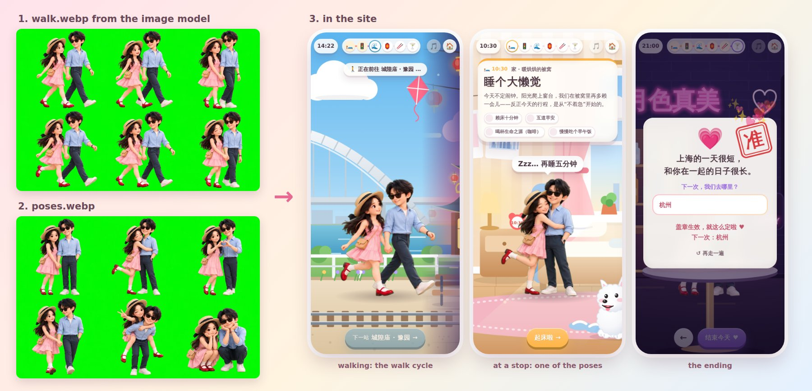

# The two characters

The couple is on every screen of the site, so they matter most. When they look like the two real people (her fringe, his glasses, the outfits they'll really wear), the site feels like *theirs*. So **go for an image model first**.

The built-in cartoon couple is the fallback. It is generic and fixed in shape: a short-haired person in a shirt on the left and a long-haired person in a dress on the right. It can't look like anyone in particular, and for many couples it gets the basics wrong.

Here is what an image model gives you. These are the real sheets from the site this skill was made from, shared by its author. They were generated with gpt-image-2 from one photo of each person:



- The two sheets are in `references/example/` (`walk.webp`, `poses.webp`). That folder is everything you need locally.
- The complete example site is at https://github.com/mark24680617/A-Date-Skill/tree/main/examples/shanghai-ai.
- The sheets show the skill's author and partner. They aren't under the skill's MIT licence (all rights reserved; see `references/example/NOTICE.md`): they're here only as an example of image-model output. Compare against them, but never put them in a user's site.

## Who generates the images

Work down this ladder and stop at the first step that works. You only need one. **If the user already chose a route** (they set a key, or prefer their own app), use that route.

| Step | Who makes the images | When | What it needs |
|---|---|---|---|
| **Level 1a** | You, with your own image tool | Your tool accepts reference images, or there are no photos anyway. It must let you save each image as a file. | Photos, or a description of the two of them |
| **Level 1b** | You, with `scripts/make-characters.mjs` | The user has an OpenAI or Google Gemini API key | The key, set as an environment variable |
| **Level 2** | The user, in an image app | Neither of the above | A ChatGPT, Gemini or 豆包 / 即梦 account (free tiers work), plus the prompt you prepare |
| **Level 3** | Nobody: the built-in couple | No image model is possible, or the user declines | Nothing |

- **Photos and a text-only tool?** Try 1b or level 2 first, since they use the photos. Use your text-only tool with the [description version](#other-ways-to-start-the-prompt) only if neither works: it still beats the built-in couple.
- **Photos give the best likeness, but they're optional.** Every image model can also draw the two of them from a description: hair, skin tone, glasses, build, outfits. That is still far closer to them than the built-in couple, so don't drop to level 3 just because there are no photos.
- **The built-in couple is also the placeholder.** The site works with it from the start. Colour it ([level 3](#level-3--fallback-the-built-in-couple)) while the images are on their way, and tell the user it's temporary.
- **Start early.** Each image takes 30 seconds to 4 minutes, and on level 2 the user has to make them. Start the characters as soon as the site folder exists and you have photos (or descriptions) and outfits, then keep building while they're made.
- **Privacy.** Photos go only to an image service the user agreed to, never anywhere else. Before you send real photos anywhere (your own image tool, or an API with 1b), name the service and let the user say no. If you can't ask, use the description version of the prompt, or prepare the level-2 prompts for them to use in their own app.
- **Cost.** API use is billed to the user's account. It's a small amount per sheet (the provider's pricing page has the numbers), and every retry costs again. Apps' free tiers have daily limits.

## What you're making

Sprite sheets: each one is a single image, a 1536×1024 landscape canvas with a grid of frames on a flat background.

| Sheet | Grid | What it is |
|---|---|---|
| `walk` | 3 × 2, 6 frames | **Required.** A walk cycle, holding hands, facing right. |
| `poses` | 3 × 2, 6 poses | **Strongly recommended.** Six still poses. Each stop shows one, and tapping the couple switches between them. |
| `idle`, `cheers`, `dinner` | 2 × 2, 4 frames | Optional extras: see [Special animations](#special-animations-at-one-stop-optional). |

The site processes the sheets by itself:
- it keys out the flat background (green, magenta or blue, detected from the image border);
- it slices the grid and finds each frame;
- it aligns the frames on the feet and upper body, so the animation doesn't wobble;
- it times the steps to the scrolling ground.

**What good sheets look like:** open `references/example/walk.webp` and `poses.webp` and compare what you get against them.
- One flat, saturated background colour, with no floor, shadows or gradient.
- The same faces, hair and outfits in every frame.
- The couple fully inside each cell, feet on the same line, with clear space between cells.
- Facing right in the walk sheet.

## Level 1: image model (you generate)

### 1a. Your own image tool

Look at your tools. If one of them generates images (built into your environment, or an MCP server), check whether it fits:
- **Photos.** If it accepts reference images, attach photo 1 (the person on the left) and photo 2 (the person on the right), and send [the prompt](#the-prompt), filled in. Name the service first, and let the user say no.
- **No photos:** a text-only tool is fine. Use the [description version](#other-ways-to-start-the-prompt) of the prompt.
- **Photos, but the tool takes text only:** go to [1b](#1b-scriptsmake-charactersmjs-with-the-users-api-key) or [level 2](#level-2-image-model-the-users-app) first, since they use the photos. Come back to the text-only tool with the description version only if neither works. It still beats the built-in couple.
- **Files.** You need each image as a file. If the tool can only show images inline and can't save them, 1a doesn't work here: go to 1b or level 2.

Then:
- **One image per sheet.** Make `walk` first, then `poses`. If you can pick a size or aspect ratio, choose 1536×1024, or landscape 3:2.
- **Save the original output file** into `<site>/assets/characters/` as `walk.<ext>` and `poses.<ext>`, with the extension of the format the tool returned (`.png`, `.jpg` or `.webp`), so a WebP never gets a `.png` name. Set `src` to match, e.g. `'assets/characters/walk.webp'`. Then go on to [Put the sheets in the site](#put-the-sheets-in-the-site).

### 1b. `scripts/make-characters.mjs` with the user's API key

The script sends the prompts to OpenAI or Google Gemini with the user's own key, and saves the sheets into the site. It needs Node 18+ and nothing else. It builds exactly the prompts in [The prompt](#the-prompt).

1. **Ask about a key** when 1a doesn't fit (no image tool, a text-only tool with photos, or no way to save the images as files), unless the user already chose a route: "Do you have an OpenAI or Google Gemini API key?" A ChatGPT or Gemini *app* account is not an API key: for those, go to [level 2](#level-2-image-model-the-users-app).
2. **Get the key into the environment, not the chat.** The script reads `OPENAI_API_KEY`, or `GEMINI_API_KEY` / `GOOGLE_API_KEY`.
   - Ask the user to set it where your commands run, e.g. `export OPENAI_API_KEY=…` in the terminal before starting you. Or they can save it in a file *outside* the site folder, and you run `OPENAI_API_KEY="$(cat <that file>)" node …`.
   - Never print the key, never write it into the site folder (it gets published) or any file you create, and never commit it.
   - If they paste it into the chat anyway, use it for this run only, as the variable on the command line. Don't save it anywhere. Suggest they replace the key afterwards, since it now sits in the chat history.
3. **Look before you send.** `--dry-run` prints the provider, model, key colour and the full prompts, and sends nothing. Before a real run with photos, tell the user which service gets them (OpenAI or Google) and let them say no.
4. **Run it with a long command timeout** (about 10 minutes) **or in the background.** A sheet takes 30 s – 4 min, and each ✓ line is printed as soon as that sheet is saved, so a run that gets cut off keeps the sheets already made. For more than two sheets, run it in the background, or one `--sheets` at a time. Then **paste the config lines it prints** into `js/config.js`. The script never edits the config itself.
5. **Check the sheets** ([below](#check-the-sheets)).

```
  node <skill>/scripts/make-characters.mjs --site <site-folder> [options]

Who they are (photos give the best likeness; descriptions alone still beat the built-in couple):
  --photo1 <file> --photo2 <file>   photo of the person on the left / on the right (jpg, png, webp; heic for gemini)
  --photo <file>                    or one photo showing both of them (left stays left)
  --describe1 "<text>"              the left person: hair, skin tone, glasses, build… (required without photos)
  --describe2 "<text>"              the right person
  --outfit1 "<text>" --outfit2 "<text>"   what they'll wear on the date (recommended)

What to make:
  --sheets walk,poses     any of: walk, poses, idle, cheers, dinner, all (default: walk,poses)
  --key-colour auto       green | magenta | blue. auto = green, or magenta when an outfit (or eye colour) is green

Image service:
  --provider openai|gemini  default: whichever key is set (OPENAI_API_KEY, else GEMINI_API_KEY / GOOGLE_API_KEY)
  --model <id>            default: openai gpt-image-2, gemini gemini-nano-banana-2.1. Without --model, if the key
                          can't use it: openai gpt-image-1.5; gemini gemini-3.1-flash-image, gemini-3-pro-image.
                          Newer models (e.g. gpt-image-2.5 variants) only with --model: they may be
                          early-access or premium
  --quality <q>           openai only: low | medium | high | auto (default high), or another level if your model
                          supports it; none = don't send it (for compatible services that reject it)
  --size <s>              openai: WIDTHxHEIGHT (default 1536x1024) · gemini: 1K | 2K | 4K (default 2K)
  --param key=value       extra request field, repeatable (gemini: a path inside generationConfig,
                          e.g. --param imageConfig.imageSize=4K). Not model, prompt, image, contents, n,
                          stream or response_format. A rejected field stops the run (no model switch)
  --timeout <seconds>     per image, 1–290 (default 290; Node can't wait longer). After a timeout the
                          remaining sheets are skipped: re-run with --sheets and the ones that are missing
  env OPENAI_BASE_URL / GEMINI_BASE_URL   a proxy or a compatible service (just the address: no user:password@, no ?query)
  env OPENAI_ORG_ID / OPENAI_PROJECT_ID   optional OpenAI headers

Other:
  --dry-run               print the prompts and the request (key hidden); send nothing, write nothing
  --overwrite             replace assets/characters/<sheet>.png (default: keep it, write <sheet>-2.png)

A sheet takes 30 s – 4 min. Run this with a long command timeout (~10 min) or in the background: each ✓ line
is printed as soon as that sheet is saved. For more than two sheets, run it in the background, or one --sheets at a time.
Exit codes: 0 all sheets made · 1 something failed · 2 no API key (prompts printed for an image app)
```

Notes on the options:
- **Models.** Without `--model`, OpenAI uses `gpt-image-2`, the model behind the example sheets. Only if the key can't use it (no access to the model, or the organization isn't verified) does the script fall back to `gpt-image-1.5`. Gemini uses `gemini-nano-banana-2.1`, then `gemini-3.1-flash-image`, then `gemini-3-pro-image`. A rejected option (size, quality, `--param`) is different: the script stops and says which field was rejected; it never switches models for that. Newer models, such as `gpt-image-2.5` variants, are used only when you pass `--model`, since they may be early-access or premium on the user's account.
- **Quality.** `low`, `medium`, `high` (the default) or `auto`, or another level if your model supports it.
- **Timeouts.** Each image waits up to `--timeout` seconds: 1–290, default 290, because Node's fetch can't wait longer for an answer. After a timeout the remaining sheets are skipped, and the script prints the `--sheets` to re-run with.
- **Photos.** JPEG, PNG or WebP. iPhone HEIC photos work with Gemini. OpenAI doesn't accept HEIC: convert them to JPEG first (the script prints the `sips` command), or use `--provider gemini` if a Gemini key is set. Large photos: resize to about 1600 px on the long side (Gemini takes about 14 MB of photos in all).
- **Key colour.** `auto` is green, or magenta when an outfit is green. Green or hazel eyes in a description count too: the key becomes magenta, unless someone wears pink, red or purple. Then it stays green, and the script asks you to check the eyes in the sheets.

Examples:

```bash
node <skill>/scripts/make-characters.mjs --site ./our-day --photo1 her.jpg --photo2 him.jpg --outfit1 "a pink dress and white sneakers" --outfit2 "a light-blue shirt and navy trousers"
node <skill>/scripts/make-characters.mjs --site ./our-day --provider gemini --describe1 "short dark curly hair, round glasses" --describe2 "long straight black hair" --outfit1 "a green hoodie and jeans" --outfit2 "a white dress"   # green hoodie → magenta key automatically
node <skill>/scripts/make-characters.mjs --site ./our-day --photo1 a.jpg --photo2 b.jpg --sheets walk,poses --dry-run
node <skill>/scripts/make-characters.mjs --site ./our-day --photo1 a.jpg --photo2 b.jpg --sheets walk --overwrite   # redo one sheet, replacing walk.png
```

What happens next:
- **Exit 0.** The sheets are saved as `<site>/assets/characters/<sheet>.png` (or `.jpg` / `.webp`, matching what came back; `<sheet>-2.png` if the file already exists). The script prints the lines to paste:
  - `walk: { src: 'assets/characters/walk.png', cols: 3, rows: 2, frames: 6, fps: 9 },`
  - inside `poses`: `src: 'assets/characters/poses.png', cols: 3, rows: 2, frames: 6, normalize: false,` (keep its `list`);
  - for `idle`: `idle: { src, cols: 2, rows: 2, frames: 4, fps: 4 }`;
  - for `cheers`, on the bar stop (idle type `'cheers'`): add `sprite: {…}` inside that stop's `idle` (keep its type and pose);
  - for `dinner`, on a restaurant, café or bistro stop (idle type `'sit'`): add `sprite: {…}` inside that stop's `idle` (keep its type and pose);
  - a reminder to run `validate.mjs`, `preview.mjs` or `sprite-check.html`;
  - for each sheet over 1 MB, a WebP conversion command (Python PIL) and the `src` to set.
- **Exit 1.** Each ✗ line says what failed, and its → line says what to do. Fix that, then run again with `--sheets` and only the sheets that failed. The sheets that worked are kept. After any error that would hit every sheet (a timeout, a rejected key or field, no quota, a model the key can't use), the remaining sheets are skipped. The last line, `Still to make: … re-run with --sheets …`, lists exactly what to re-run. Error by error: troubleshooting.md.
- **Exit 2.** No API key. The script printed one finished prompt per sheet: go to [level 2](#level-2-image-model-the-users-app) with them.

## Level 2: image model (the user's app)

When you can't generate images yourself, or the user would rather use their own app, they can make them in a few minutes, in an app they may already have:
- **ChatGPT** (chatgpt.com or the app);
- **Google Gemini** (gemini.google.com or the app);
- **豆包 Doubao / 即梦 Jimeng**: the easiest from mainland China.

Most have a free tier with a daily limit.

1. **Prepare the exact prompts.** Fill in [the prompt](#the-prompt) yourself, or let the script do it: run it with `--dry-run` (or with no key set), and it prints one finished prompt per sheet. It needs photo paths or descriptions. If the photos aren't on this machine, pass placeholder names (`--photo1 left.jpg --photo2 right.jpg`): the prompt only needs to know there are two photos, so the photos can stay on the user's phone. `--site` is optional here.
2. **Send the user short steps, in their language,** something like:

   > To turn you two into cartoon characters (about 5 minutes):
   > 1. Open ChatGPT, Gemini or 豆包 and start a new chat.
   > 2. Upload both photos: first the one of *[left person]*, then *[right person]*.
   > 3. Paste prompt 1 below and send. The picture takes a minute or two.
   > 4. In the same chat, paste prompt 2 and send. Staying in one chat keeps you looking the same in both pictures.
   > 5. Save each picture with the app's download button (not a screenshot). Send them to me, or save them in a folder and tell me where.
   >
   > *[prompt 1: walk]*
   >
   > *[prompt 2: poses]*
   >
   > Until they arrive, the site shows a placeholder cartoon couple.

   Without photos, leave out step 2: the prompts already describe them.
3. **Get the actual files.** A picture pasted into the chat may be something you can see but not a file you can copy. Ask where they saved it (e.g. their Downloads folder), or ask them to drop the files into `<site>/assets/characters/`.
4. **Check what came back** ([below](#check-the-sheets)). If a sheet is off, tell them exactly what to ask the app for, e.g. "the same again, but keep the background one flat pure green", or which single sheet to redo.

App tips to pass on when useful:
- One prompt per picture. If the app asks a question back, answer "yes, exactly as described".
- If the app has an aspect-ratio option, choose landscape 3:2.
- A small app watermark in a corner is fine, unless it lands inside a cell next to the couple. Then crop it out, or generate again.

## The prompt

Level 1a and level 2 use this text. The script builds the same wording itself. **Keep it identical to `SHEETS` and `buildPrompt` in `scripts/make-characters.mjs`**: if you change one, change the other.

With two photos, attach photo 1 (the person on the left) and photo 2 (the person on the right), then send:

```text
Using the two attached photos as reference (photo 1 is the person on the left, photo 2 is the person on the right), create a 3D animated-movie version of this couple in a Pixar-style cartoon look: keep their faces, hairstyles and hair colours recognisable, but stylise them with slightly bigger heads (about 1:3 head-to-body), large expressive eyes, soft rounded shapes, smooth matte skin and warm, soft studio lighting. The person on the left wears [OUTFIT 1]; the person on the right wears [OUTFIT 2] — nothing [KEY COLOUR NAME] on either of them. Show both full-body at the same scale, [ACTION]. The characters, outfits, colours, proportions, lighting and camera angle must be identical in every frame, as if every frame were rendered from the same animation rig.

Lay it out as a clean animation sprite sheet on a 1536×1024 landscape canvas: a grid of [3 columns × 2 rows] equal cells holding [6] frames, read left-to-right then top-to-bottom, that loop seamlessly. Centre the couple in each cell with their feet on the same baseline near the bottom of the cell, filling about 80% of the cell height, and leave clear empty space between cells so nothing touches or crosses a cell edge. The background must be one flat, pure chroma-key [KEY COLOUR NAME] ([KEY HEX]) everywhere — no floor, no cast shadows, no gradient, no grid lines, borders, frame numbers, text or watermark.
```

| File | Grid | `[ACTION]` |
|---|---|---|
| `walk.png` | 3 × 2, 6 frames | walking to the right in a three-quarter side view, holding hands between them, in one complete walk cycle — contact, down, passing, up for each leg — with their free arms swinging naturally and a slight up-and-down bob; frames 3 and 6 are the passing poses with the legs almost together |
| `poses.png` | 3 × 2, 6 poses | six different sweet still poses rather than an animation, in this order: standing holding hands; a hug with one of them lifting a foot; making a heart shape with their hands together; strolling hand in hand; one giving the other a piggyback ride with a V sign; squatting side by side with their chins resting on their hands |
| `idle.png` (optional) | 2 × 2, 4 frames | standing hand in hand, turned slightly toward the viewer, gently swaying and breathing, glancing at each other and smiling, with one blink |
| `cheers.png` (optional) | 2 × 2, 4 frames | standing side by side, each holding a drink, raising them and clinking gently, then smiling at each other |
| `dinner.png` (optional) | 2 × 2, 4 frames | seated side by side on low stools with no table, turned slightly toward the viewer; one feeds the other a bite with a fork/chopsticks and they lean in happily |

Filling it in:
- **`[ACTION]`:** from the table, one sheet per prompt.
- **2 × 2 sheets:** change `[3 columns × 2 rows]` to `2 columns × 2 rows` and `[6]` to `4`.
- **`poses`:** replace "that loop seamlessly" with "each a separate pose".
- **Outfits.** Describe what they'll really wear on the date, or what they wear in the photos. Be specific: "a cream knit sweater, light-blue jeans and white sneakers". With photos and no outfit, the script writes "the outfit from photo 1" / "the outfit from photo 2". The outfit is drawn into every frame, so if it comes from the photos, check that it suits the season and weather of the date (a summer dress for a December day?), and mention it in the hand-off.
- **Key colour.** Normally green, `#00FF00`. If either of them wears green (a green hoodie, a mint dress, teal, olive), use **magenta, `#FF00FF`**. Why: clothes in the key colour turn see-through when the site removes the background. With magenta, pink, red and purple clothes are the risk; with green, green and teal are. Green or hazel eyes are a smaller risk of the same kind: prefer magenta for them too, unless someone wears pink, red or purple. The site detects the background colour by itself, so nothing else changes. If one wears green and the other pink, blue (`#0000FF`) is the third option, unless someone wears blue. The script picks green or magenta automatically and warns about a clash.
- **Different poses.** If you change the poses, update the `poses.list` names and `say` lines to match their order.
- **Left and right.** Image models don't always keep the order: in the example, photo 1 ended up on the right. The site doesn't care. Regenerate only if the user minds.

### Other ways to start the prompt

Everything after the first sentence stays the same.
- **One photo of both of them:** replace `Using the two attached photos as reference (photo 1 is the person on the left, photo 2 is the person on the right),` with `Using the attached photo of the two of them as reference (whoever is on the left in the photo stays on the left),`. Without outfits, the script writes "their outfit from the photo".
- **No photos, a description instead:** replace the first sentence with the text below. Describe each person's hair (length, colour, curls, fringe), skin tone, glasses, build and anything else that makes them *them*. Without outfits, the script writes "the clothes described above" if the description mentions clothes, and otherwise "a casual date outfit".

  ```text
  Create a 3D animated-movie version of a couple in a Pixar-style cartoon look. The person on the left: [DESCRIPTION 1]. The person on the right: [DESCRIPTION 2]. Stylise them with slightly bigger heads (about 1:3 head-to-body), large expressive eyes, soft rounded shapes, smooth matte skin and warm, soft studio lighting.
  ```
- **Photos plus details** (a new haircut, glasses missing in the photo): after the first sentence, add ` Extra details — the person on the left: […]; the person on the right: […].` The script does this when you pass `--describe1` / `--describe2` together with photos.

## Put the sheets in the site

1. **Files.** `<site>/assets/characters/walk.<ext>` and `poses.<ext>`, with the extension of the format they came in (`.png`, `.jpg` or `.webp`). The script saves them there; files from an app or your own tool go there too. WebP loads much faster than PNG on phones: convert with `cwebp -q 85 walk.png -o walk.webp`, or Python PIL `img.save('walk.webp', quality=85)`, then point `src` at the new file. The example sheets are about 180 KB each as WebP. `validate.mjs` warns about any sheet over 1 MB and prints the exact command.
2. **Config.** Set the paths to the real file names (the script prints these lines):
   ```js
   walk:  { src: 'assets/characters/walk.png',  cols: 3, rows: 2, frames: 6, fps: 9 },
   poses: { src: 'assets/characters/poses.png', cols: 3, rows: 2, frames: 6, normalize: false, list: [...] },
   ```
   Keep the `poses.list`: one name and `say` line per pose, in the order of the sheet.
3. **Poses.** Choose one per stop with `idle.pose`, and set `coverPose`.
4. **Keep `characters.builtin` coloured anyway** ([level 3](#level-3--fallback-the-built-in-couple)). It's what shows if a sheet ever fails to load.

## Check the sheets

Always look before the hand-off. A bad frame is obvious on a phone.
- **Preview.** `node <skill>/scripts/preview.mjs <site>`, then open the screenshots: the couple at each stop, and the `flow-*.png` walking frames.
- **Sprite checker.** `node <skill>/scripts/serve.mjs <skill>/template`, open `/tools/sprite-check.html`, and drag the sheet in. It lives in the skill, not in the site you built. It shows the detected frames, the aligned loop with an onion skin, and the exact `cols / rows / frames` line to paste.
- **Open sites through a server** (`serve.mjs`), not as a `file://` page: browsers block the pixel processing there, and the built-in couple shows instead.

Compare with `references/example/walk.webp` and `poses.webp`:
- [ ] The grid is what the config says (3 × 2, 6 frames).
- [ ] The same faces, hair and outfits in every frame.
- [ ] The walk loops without a jump, holding hands, facing right.
- [ ] No frame is cut off at a cell edge, and nothing crosses into the next cell.
- [ ] The background keyed out cleanly: no coloured halo you'd notice on a phone, and no see-through clothes.
- [ ] The poses are in the order of `poses.list`.

## When it goes wrong

| Problem | Fix |
|---|---|
| The model drew a different grid (e.g. 4 × 2) | Set `cols` / `rows` / `frames` to what it drew, or regenerate. |
| A square or portrait image instead of 3:2 | Fine if the grid is clean: set `cols` / `rows` / `frames` to match. |
| One frame has a different outfit or face | Regenerate that sheet. Consistency beats detail. |
| Frames are different sizes | Usually fine: walk frames are auto-scaled. Use `normalize: false` on poses, so a squatting pose stays small. |
| A floor, shadow or gradient in the background | Regenerate. The site needs one flat colour. |
| Green fringe around hair | Regenerate with a cleaner background, or accept it: on phones it's barely visible. |
| White or transparent background instead of green | Transparent works. White works unless they wear white. |
| Part of an outfit turned see-through | The outfit is close to the key colour. Regenerate with the other key (green ↔ magenta). |
| The eyes look hollow or grey | Green or hazel eyes on a green key. Regenerate with `--key-colour magenta`, or blue when someone wears pink or red. |
| The couple walks the wrong way | Nothing to do: the site mirrors them when walking back. They should face **right** in the sheet. |
| It doesn't look like them | Use clearer photos (face visible, good light), add extra details, or try the other provider or app. |
| The service refused (safety filter) | Photos of real people and close poses (hug, piggyback) sometimes trip it. Run again, since it varies. Then try a description instead of photos, the other provider, or the app route. |
| A watermark inside a cell | Crop it out, or regenerate. |
| Characters look too big or small | `characters.height` (0.3–0.42). |
| They float or sink on a generated background | `groundY` of that stop (backgrounds.md). |

For script errors (no key, a rejected key, a model the key can't use, quota, a timeout, blocked network), the script's → line says what to do. troubleshooting.md has a row for each.

## Level 3 / fallback: the built-in couple

Use the built-in couple only when no image model is possible, or the user prefers not to use one (privacy, cost). Also use it as the placeholder while images are on their way. It's a hand-drawn cartoon pair with a real walk cycle, recoloured to match the two of them. The site uses it whenever `walk.src` is `''`.

The built-in pair is fixed in shape:
- `a` (left): short hair, shirt, trousers;
- `b` (right): long hair, dress.

If you can see the photos, pick colours from them. Otherwise ask ("hair colour? favourite outfit colours?").

```js
characters: {
  walk: { src: '' }, poses: { src: '' },   // '' = built-in couple
  builtin: {
    a: { skin: '#E8B894', hair: '#1F1A17', top: '#F4F1EA', bottom: '#2F3E5C' },
    b: { skin: '#FFDCC2', hair: '#6B4331', dress: '#FFB7C5', shoes: '#A8423F' },
  },
}
```

- Keep colours soft and a little brighter than in the photo: the cartoon style likes pastels.
- Skin: use a mid-tone of the person's skin. Shading is derived automatically.
- **What's fixed in the built-in look:**
  - `a` has short straight hair and a collared shirt;
  - `b` has long straight hair, a pink bow, a dress and a small crossbody bag;
  - no curls, hoods, glasses or hats.

  Get close with colours: a green hoodie becomes a green `top`.
- **When the built-in look is wrong for them** (two women, two men, two people with short hair, anyone who wouldn't wear the dress), push harder for an image model: it draws them as they are. Tell the user that's why you recommend it.
- **Skin tone unknown** (no photo, and you can't ask)? Keep the template defaults (`#FFDCC2` for both) and mention it in the hand-off, so the user can tell you.
- **In the hand-off,** say where the cartoon doesn't match them ("for now the cartoon shows you with long hair"). If images are still pending, say the cartoon is a placeholder, and include the prompts (or offer to make the images if they set an API key in their terminal). deploy.md has the wording.

## Special animations at one stop (optional)

Once the walk and poses sheets exist, one stop can get its own animation: a toast at the bar, feeding each other at dinner. Make it with the same image model and the same photos and outfits, so it's the same couple. The script makes them with `--sheets cheers,dinner` and prints the lines. Add `sprite: {…}` inside that stop's `idle`, and keep its `type` and `pose`:

```js
idle: { type: 'cheers', pose: 'hold', sprite: { src: 'assets/characters/cheers.png', cols: 2, rows: 2, frames: 4, fps: 4, height: 0.34 } },   // bar
idle: { type: 'sit', pose: 'chin', sprite: { src: 'assets/characters/dinner.png', cols: 2, rows: 2, frames: 4, fps: 4, height: 0.34 } },      // restaurant / café / bistro
```

`height` is relative to the scene. Tune it until the characters look right next to the table.
